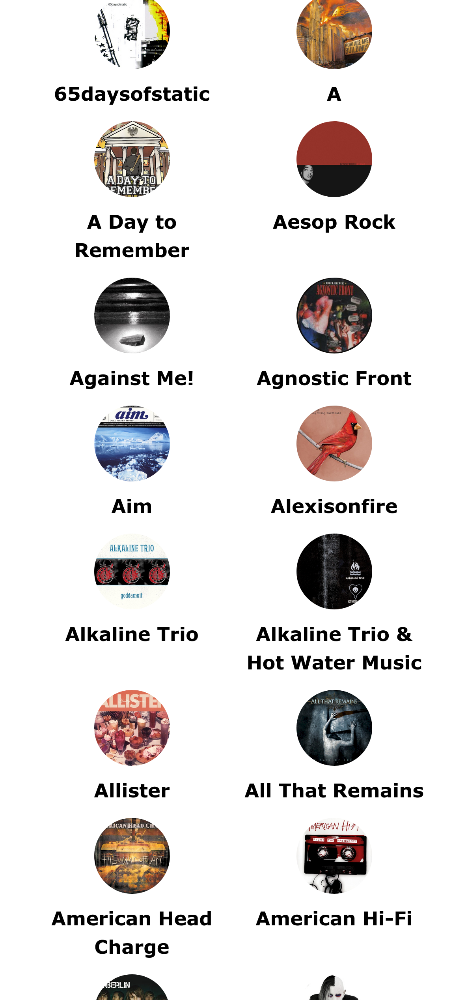
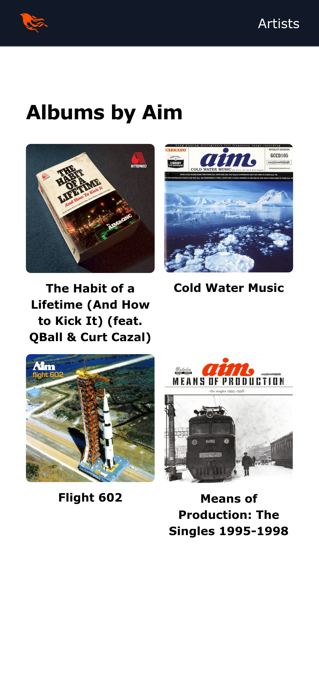
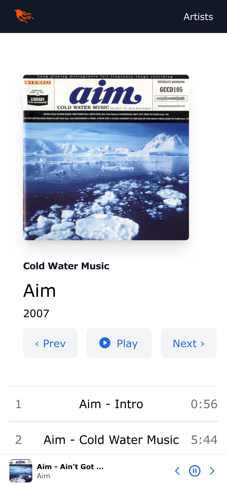

# Atlas - Web Music Streaming Application

Atlas is a self-hosted music streaming application built with Elixir, Phoenix, and LiveView. It allows you to browse and play your personal music library directly in your web browser with a seamless, single-page application experience.

## Features

- **Music Library Management**: Python script scans your music directory structure to extract metadata (artist, album, track number) and imports it into PostgreSQL
- **Continuous Playback**: Music keeps playing while you navigate between pages thanks to LiveView's websocket architecture
- **Artist/Album Browsing**: Browse your music collection by artist and album
- **Search Functionality**: Find tracks, albums, and artists with the integrated search
- **Responsive Design**: Works on desktop and mobile browsers

## Screenshots

<div align="center">
  
  
  
</div>

## Technology Stack

- **Backend**: Elixir + Phoenix Framework
- **Frontend**: Phoenix LiveView with JavaScript for audio playback
- **Database**: PostgreSQL for music metadata storage
- **Metadata Processing**: Python script for directory scanning and metadata extraction

## Getting Started

### Prerequisites

- Elixir and Erlang
- Phoenix Framework
- PostgreSQL
- Python 3.x (for the music scanner script)
- A collection of music files organized in directories

### Installation

1. Clone the repository:

   ```bash
   git clone https://github.com/SarsaparillaSunrise/atlas.git
   cd atlas
   ```

2. Install Elixir dependencies:

   ```bash
   mix deps.get
   ```

3. Create and migrate the database:

   ```bash
   mix ecto.setup
   ```

4. Start the Phoenix server:

   ```bash
   mix phx.server
   ```

5. Visit [`localhost:4000`](http://localhost:4000) in your browser

### Importing Your Music Library

The ingestion script expects your music to be organized in a directory structure like:

```
/path/to/music/
├── Artist Name/
│   ├── (Album Year) - Album Name/
│   │   ├── 01 Track Name.mp3
│   │   ├── 02 Another Track.mp3
│   │   └── ...
│   └── ...
└── ...
```

Create a virtualenv for [TinyTag](https://github.com/tinytag/tinytag) and Postgres drivers, install deps:

```bash
cd lib/atlas/ingest
python -m venv .env
source .env/bin/activate
pip install -r requirements.txt
```

Ingest your music directory:

```bash
python ingest.py
```
